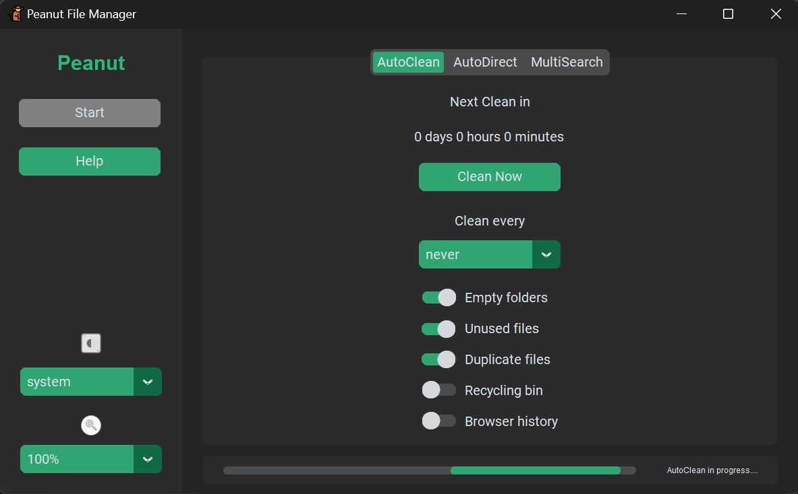
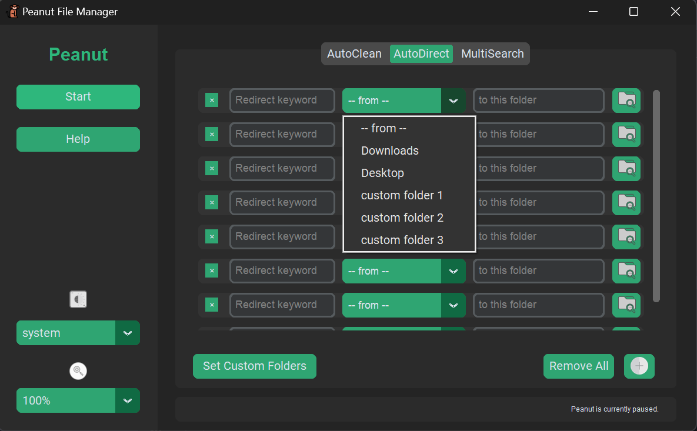
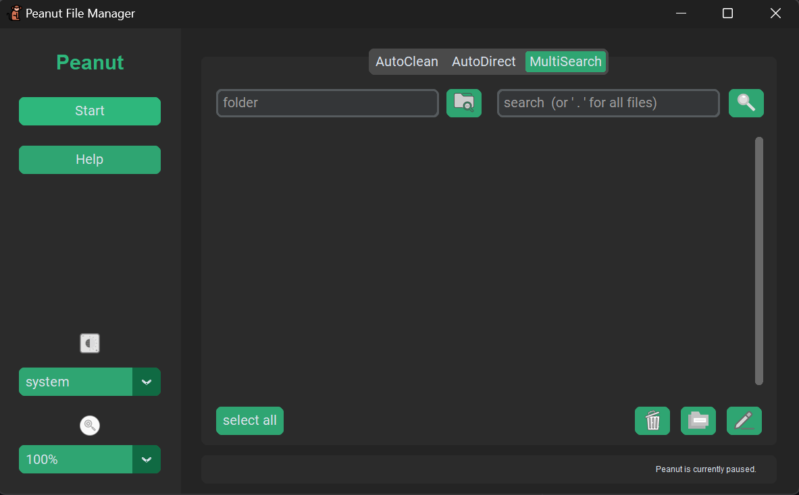

# Peanut Automated File Manager
 Meet Peanut, your friendly file-managing squirrel monkey! Peanut is here to make your life easier by helping you clean up unused files, organize them efficiently, and quickly find exactly what you're looking for. Whatever your file management needs, Peanut's got you covered!
## Features 
- **AutoClean** - Automatically clean up empty folders, unused files, duplicate files, and more to keep your system tidy and fast. 
- **AutoDirect** - Effortlessly organize your files by setting up rules based on keywords. 
- **MultiSearch** - Search for files, rename them, convert formats, and more--all in one go! 
- **User Preferences** - Peanut remembers your settings and preferences using a built-in SQLite database.

## How to Install & Run
1. **Clone the Repo**: `git clone https://github.com/KatavinaNguyen/Peanut.git`
2. **Install Dependencies**: Make sure Python is installed, then run `pip install -r requirements.txt`
3. **Run Peanut**: Now you can run `python main.py` to begin the program.

## How to Use
Open Peanut and start by setting up your preferences. 
> [!TIP]
> The **Help** menu has more in-depth information with FAQs.

Navigate the 3 tabs at the top of the **Main Screen**. 
+ Use the **AutoClean** feature to sweep away unnecessary files.
+ Set up **AutoDirect** rules to keep your files organized automatically. 
+ Try out **MultiSearch** for complex file operations.  

